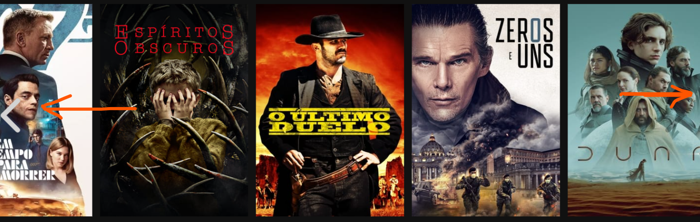
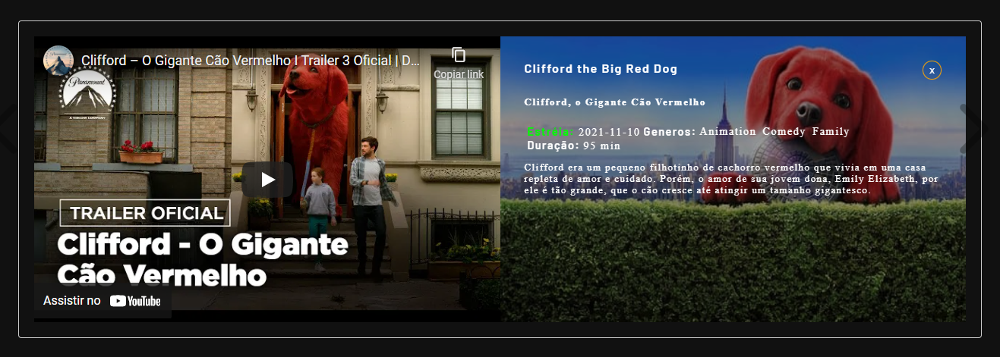
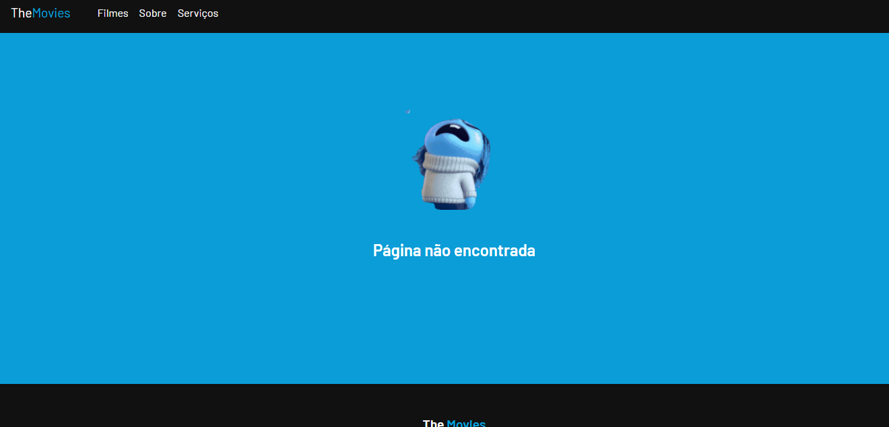

<h1 style="text-align:center"> TheMovies </h1>

Listagem de filmes

 O objetivo desse app é consumir a api do <strong>themoviedb</strong> e criar um catálogo de filmes 

<h2>FUNCIONAMENTO</h2>

Assim que a pagina carregar o app vai vissitar a api mencionada acima e trazer duas listas

<ul> 
<li>Em exibição nos cinemas</li>
<li>Lançados em Novembro - 2020</li>

</ul>

<h2>INTERAÇÃO</h2>

O usuario poderá explorar os filmes clicando nas setas que aparecerão ao <storng title='mouse'>pairar o rato</strong> sobre a lista 

Poderá ver a  <strong title='teaser - prévia'> prévia</strong> e <storng>informação sobre o filme</strong>  clicando em um dado filme

Caso clique em <strong>link </strong> que direcione para uma rota não implementada será exibida a pagina <strong>404 </strong> personalizada 

<h3 style="margin-top:30px">COMO CRIAR CONTAINER</h3>

  <ul> 
   <li> docker-composer up </li>
  </ul>

<h3 style="margin-top:30px">COMO TESTAR O PROJETO</h3>
<ul> 
<li>clone ou baixe o projeto</li>
<li>Abra o terminal na raiz do projeto</li>
<li>Execute o comando para instalar as dependencias
  <ul> 
   <li> Yarn: yarn install </li>
  </ul>
</li>
<li>Após instaladas das dependendica rode:
<ul> 
   <li> Yarn: yarn start </li>
  </ul>
</li>

</ul>

<strong> </strong>